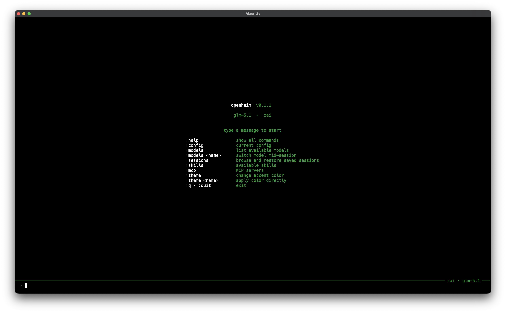
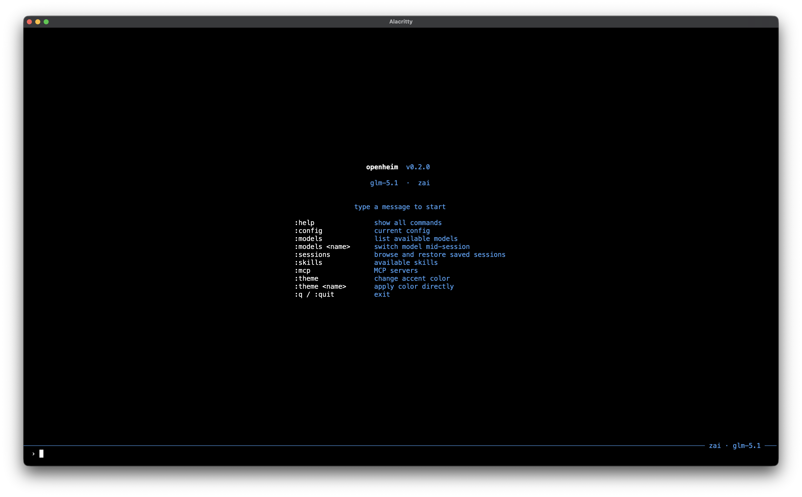
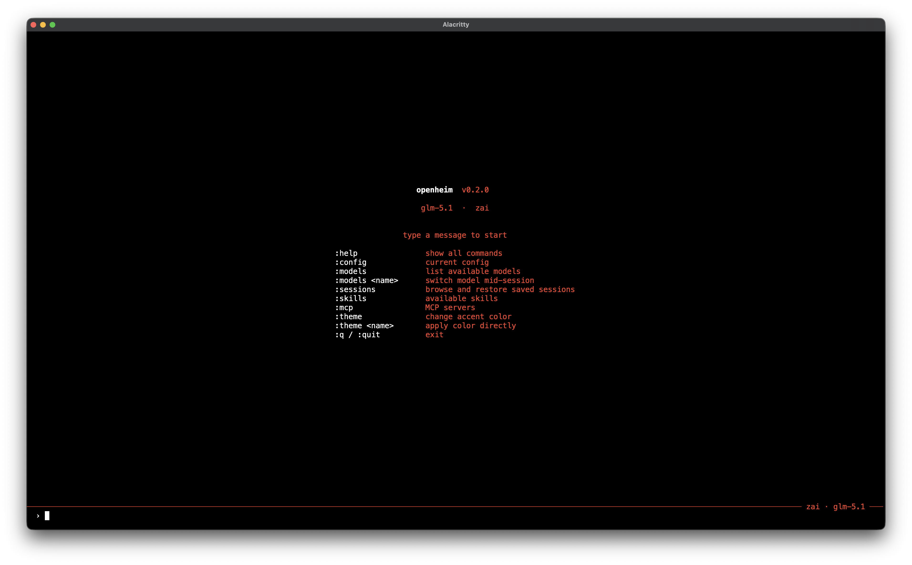
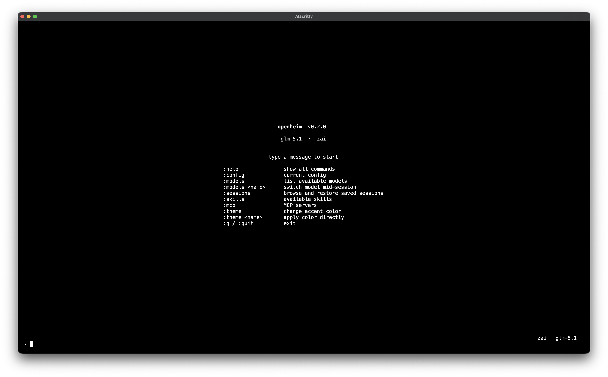

<div align="center">

#  openheim

[openheim.io](https://openheim.io)

[](https://github.com/weirdstuff-dev/openheim/actions/workflows/ci.yml)
[](https://crates.io/crates/openheim)
[](https://docs.rs/openheim)
[](./LICENSE)
[](https://www.rust-lang.org)
</div>

**A fast, multi-provider LLM agent runtime built in Rust.**

<div align="center">
<table>
<tr>
  <td></td>
  <td></td>
</tr>
<tr>
  <td></td>
  <td></td>
</tr>
</table>
</div>

Openheim runs an iterative agent loop — it calls your LLM, executes tools on its behalf, feeds results back, and repeats until the task is done. It works as an interactive REPL, a headless CLI, an ACP stdio agent (for Zed, Claude Code, and other ACP clients), or a self-hosted ACP-over-WebSocket server.

---

## Why Rust?

Openheim is built in Rust from the ground up:

- **Low memory**
- **Fast startup**
- **True concurrency**
- **Memory-safe by default**

---

## Features

- **Multi-provider** — OpenAI, Anthropic Claude, Google Gemini, and any OpenAI-compatible endpoint (Ollama, vLLM, LM Studio, etc.)
- **Tool execution** — built-in shell, file read, and file write tools. Trait-based, so you can add your own.
- **MCP (Model Context Protocol)** — connect external MCP servers (stdio or Streamable HTTP) and their tools are automatically exposed to the LLM as `{server_name}__{tool_name}`.
- **Conversation memory** — conversations (including full tool call history) persist to disk and resume across sessions
- **System identity** — edit `~/.openheim/system.md` to define how the agent presents itself. Required when preparing a session (created by `openheim init`).
- **Skills** — drop a markdown file into `~/.openheim/skills/` and it's injected into the system prompt. Set `default_skills` in config to auto-load skills every session; pass `--skills` for per-session additions. ACP clients can also pass skills per-session via `_meta`.
- **ACP transport** — implements the [Agent Client Protocol](https://github.com/block/agent-client-protocol) over stdio (for editor integrations) and WebSocket (for remote clients), with real-time streaming of message chunks and tool calls
- **Unified WebSocket** — single multiplexed `WS /ws` connection carries both ACP agent traffic (sessions, streaming, tool calls) and filesystem operations (file CRUD, live watching) via channel envelopes
- **Retry with backoff** — transient failures (429s, 5xx, network errors) are retried automatically with exponential backoff
- **Docker ready** — multi-stage Dockerfile and docker-compose included

---

## Quickstart

### Prerequisites

- Rust 1.85+
- An API key for at least one supported provider

### Install

```bash
cargo install openheim
```

Or build from source:

```bash
git clone https://github.com/weirdstuff-dev/openheim.git
cd openheim-core
cargo build --release
```

### Configure

```bash
# Generate the default config and system.md
openheim init

# Edit them
vim ~/.openheim/config.toml
vim ~/.openheim/system.md
```

Example config:

```toml
default_provider = "anthropic"
max_iterations = 10

# Skills loaded in every new session automatically (no --skills flag needed)
# default_skills = ["rules"]

[providers.anthropic]
api_base = "https://api.anthropic.com/v1"
default_model = "claude-sonnet-4-6"
models = ["claude-sonnet-4-6", "claude-opus-4-7"]
env_var = "ANTHROPIC_API_KEY"

[providers.openai]
api_base = "https://api.openai.com/v1"
default_model = "gpt-4o"
models = ["gpt-4o", "gpt-4-turbo"]
env_var = "OPENAI_API_KEY"

[providers.gemini]
api_base = "https://generativelanguage.googleapis.com/v1beta"
default_model = "gemini-2.5-flash"
models = ["gemini-2.5-flash", "gemini-2.5-pro"]
env_var = "GEMINI_API_KEY"

# Local Ollama (no API key needed)
[providers.ollama]
api_base = "http://localhost:11434/v1"
default_model = "llama3"
models = ["llama3", "mistral", "codellama"]

# MCP servers — tools are exposed as "{server_name}__{tool_name}"
# [mcp_servers.filesystem]
# command = "npx"
# args = ["-y", "@modelcontextprotocol/server-filesystem", "/tmp"]
#
# [mcp_servers.remote-tools]
# url = "http://localhost:8080/mcp"
```

### Run

```bash
# Interactive REPL (default — no subcommand)
openheim

# Load skills in the REPL
openheim --skills rust,debugging

# Single headless prompt, streams to stdout
openheim run "List the files in the current directory"

# Single headless prompt with a model override
openheim run "Hello" --model gpt-4o

# ACP stdio agent (for Zed, Claude Code, and other ACP clients)
openheim acp

# ACP-over-WebSocket server
openheim serve
openheim serve --host 0.0.0.0 --port 1217

# Initialize config
openheim init
```

---

## How the agent loop works

```
User prompt
    │
    ▼
Send conversation + tools → LLM
    │
    ├─ Tool call requested? → Execute tool → feed result back → repeat
    │
    └─ Final response → done
```

Conversations are saved to `~/.openheim/history/` as JSON after every run.

---

## Agent identity and skills

### `~/.openheim/system.md`

This file defines the agent's base identity. It is loaded when preparing each session (via `prepare()` / session setup) and is required — run `openheim init` to create it, then edit it freely.

```markdown
You are a senior software engineer who writes clean, idiomatic code.
You prefer simple solutions and ask clarifying questions before making large changes.
```

### Skills

Skills are markdown files in `~/.openheim/skills/`. They are injected into the system prompt after the identity block.

```bash
# Run with specific skills for this session
openheim --skills rust,debugging

# Always load certain skills (set in config.toml)
# default_skills = ["rules", "concise"]
```

The system message the LLM receives is assembled in this order:

```
You are a general purpose multiprovider LLM agent.

---

The user has given you the following identity:

<system.md content>

---

These are the skills you have mastered:

### rust
<rust.md content>
```

ACP clients (Zed, Claude Code, etc.) can pass skills per-session by including a `skills` array in the `_meta` field of the `NewSession` request — no flag needed on the server side.

---

## Server mode

Start with `openheim serve` (defaults to `0.0.0.0:1217`).

The server speaks the [Agent Client Protocol](https://github.com/block/agent-client-protocol) over WebSocket and exposes a multiplexed WS endpoint plus REST API routes:

### WebSocket

| Endpoint | Description |
|---|---|
| `WS /ws` | Single multiplexed connection carrying two channels via JSON envelopes: **agent** (ACP sessions, streaming, tool calls) and **fs** (file CRUD, live watching) |

Every message is wrapped in `{ "channel": "<agent|fs>", "data": <payload> }`.

### REST API

| Endpoint | Description |
|---|---|
| `GET /api/config` | Public config (providers, models — API keys stripped) |
| `GET /api/models` | Available models per provider |
| `GET /api/skills` | List of installed skills |
| `GET /api/tools` | All registered tool definitions (built-in + MCP) |
| `GET /api/mcp-servers` | MCP server connection statuses |
| `GET /api/sessions` | All persisted sessions (metadata only, newest first) |
| `GET /api/sessions/{id}` | Full conversation — messages, tool calls, and metadata |

> **Frontend / WebSocket implementors:** see [docs/api.md](./docs/api.md) for the complete protocol reference, TypeScript interfaces, and sequence diagrams.

---

## Documentation

| Guide | Description |
|-------|-------------|
| [docs/architecture.md](./docs/architecture.md) | Module map and prompt flow |
| [docs/configuration.md](./docs/configuration.md) | Full `config.toml` reference |
| [docs/library.md](./docs/library.md) | Embedding openheim as a Rust library |
| [docs/skills.md](./docs/skills.md) | Writing and enabling skill files |
| [docs/deployment.md](./docs/deployment.md) | Docker, systemd, reverse proxy, enterprise |
| [docs/custom-tools.md](./docs/custom-tools.md) | Implementing a custom `ToolHandler` |
| [docs/custom-llm-provider.md](./docs/custom-llm-provider.md) | Implementing a custom `LlmClient` |
| [docs/api.md](./docs/api.md) | REST + WebSocket API spec |
| [docs.rs/openheim](https://docs.rs/openheim) | Rust API reference (auto-generated) |

---

## Use as a library

Openheim can be embedded directly in your Rust application via the `openheim` crate. The library exposes the full agent runtime — sessions, streaming, conversation history, skills, and MCP servers — through a single `OpenheimClient` facade.

```toml
# Cargo.toml
[dependencies]
openheim = "0.1"
tokio = { version = "1", features = ["full"] }
```

See **[docs/library.md](./docs/library.md)** for the full API reference, session management, multi-turn conversations, and MCP integration.

---

## Docker

```bash
# Build and start with docker-compose
docker-compose up --build

# Or run manually
docker build -t openheim .
docker run -p 1217:1217 \
  -e OPENAI_API_KEY=sk-your-key \
  -v $(pwd)/workspace:/workspace \
  openheim serve
```

---

## Project structure

```
src/
  main.rs           Entry point and subcommand dispatch
  lib.rs            Public API surface
  error.rs          Error types (with retryable classification for backoff)
  config/           Config loading, provider/model resolution, defaults
  core/
    agent.rs        Agent loop (streaming variant)
    models.rs       Message, Tool, Choice, and WebSocket envelope types
    llm/            LLM client trait and provider implementations
      anthropic.rs    Anthropic Messages API client
      gemini.rs       Google Gemini API client
      openai.rs       OpenAI API client
      openai_compatible.rs  Generic OpenAI-compatible client (Ollama, etc.)
      retry.rs        Automatic retry with exponential backoff
  tools/            Tool trait, registry, and built-in tools
    execute_command.rs / read_file.rs / write_file.rs
  mcp/              MCP (Model Context Protocol) client integration
    client.rs       MCP server connection (stdio + Streamable HTTP)
    tool_handler.rs  Adapts MCP tools to the ToolHandler trait
  rag/              Conversation history, prompt builder, skills manager, and system identity
  acp/              ACP agent core — session state and protocol handling
  transport/
    stdio.rs        ACP-over-stdio transport (for editor integrations)
    ws.rs           Multiplexed WebSocket server (axum) + REST API + filesystem channel
    run.rs          Headless single-prompt transport
  tui/              Interactive rustyline REPL
```

---

## Development

```bash
RUST_LOG=debug openheim run "test"
cargo test
cargo fmt --check
cargo clippy
```

---

## Contributing

Contributions are welcome.

---

## License

See [LICENSE](./LICENSE) for details.